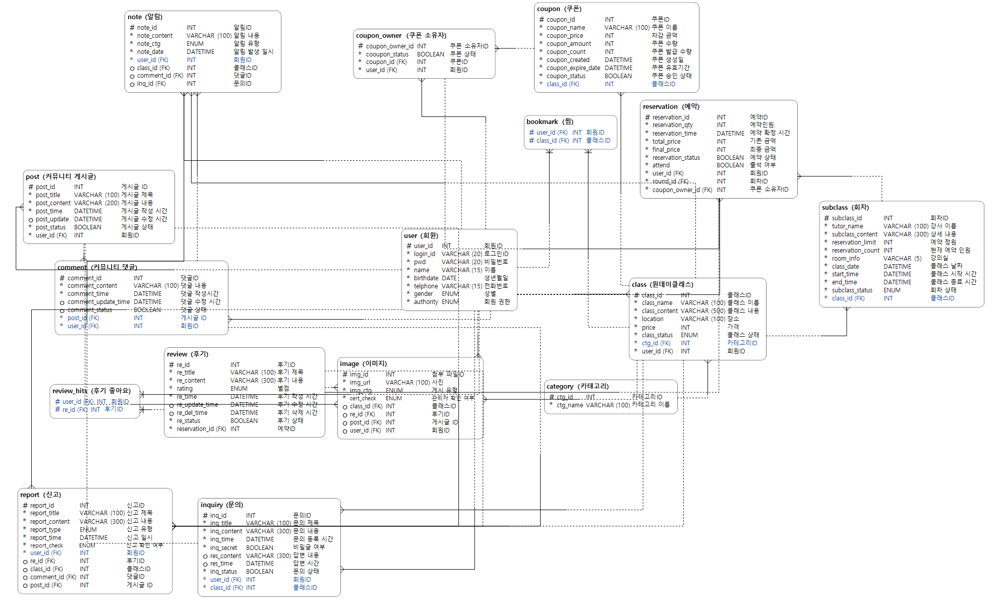

### 🪪팀명 : 테크스미스
 

## 🕵️팀원

 
 

|||||||
|:-:|:-:|:-:|:-:|:-:|:-:|
|권형미 [@hyomee2](https://github.com/hyomee2)|김민주 [@minju0224](https://github.com/minju0224)|김영기 [@we4sley](https://github.com/we4sley)|김윤후 [@WhooGeek](https://github.com/WhooGeek)|김재훈 [@KimJaehoon64](https://github.com/김재훈)|박설빈 [@seolbin01](https://github.com/seolbin01)|

 
 
 

##  📝 프로젝트 소개

### CatchClass

>캐치클래스는 원데이클래스를 쉽고 빠르게 등록하고 신청할 수 있는 플랫폼입니다. 원하는 원데이클래스 수업을 간편하게 개설하고, 열려 있는 클래스에 참여할 수 있습니다. 또한, 원데이클래스 관련 커뮤니티에서 유용한 정보를 공유하고 다양한 팁을 얻을 수 있습니다. 특별한 쿠폰을 통해 친구나 동료들과 부담 없이 새로운 추억을 만들어보세요. 취미를 찾고 싶은 분들은 캐치클래스를 통해 다양한 경험을 쌓고, 인생의 또 다른 재미를 발견해 보세요.
>

## 💬 프로젝트 배경

[노인 학습에 관한 연구](https://private-user-images.githubusercontent.com/74580387/352433895-7a0acb58-b7c6-4202-a8d3-ce729bfba6dd.jpg?jwt=eyJhbGciOiJIUzI1NiIsInR5cCI6IkpXVCJ9.eyJpc3MiOiJnaXRodWIuY29tIiwiYXVkIjoicmF3LmdpdGh1YnVzZXJjb250ZW50LmNvbSIsImtleSI6ImtleTUiLCJleHAiOjE3MjE5Nzk3NDMsIm5iZiI6MTcyMTk3OTQ0MywicGF0aCI6Ii83NDU4MDM4Ny8zNTI0MzM4OTUtN2EwYWNiNTgtYjdjNi00MjAyLWE4ZDMtY2U3MjliZmJhNmRkLmpwZz9YLUFtei1BbGdvcml0aG09QVdTNC1ITUFDLVNIQTI1NiZYLUFtei1DcmVkZW50aWFsPUFLSUFWQ09EWUxTQTUzUFFLNFpBJTJGMjAyNDA3MjYlMkZ1cy1lYXN0LTElMkZzMyUyRmF3czRfcmVxdWVzdCZYLUFtei1EYXRlPTIwMjQwNzI2VDA3MzcyM1omWC1BbXotRXhwaXJlcz0zMDAmWC1BbXotU2lnbmF0dXJlPTA3YzMzNjBiZTgzNDczNzU4ODhiMmIxNmI4ZTI1MmY5ZGZlOWY4M2QwYjUxYjcyMzRkZGMxMjQ4NWFjZTg0NWUmWC1BbXotU2lnbmVkSGVhZGVycz1ob3N0JmFjdG9yX2lkPTAma2V5X2lkPTAmcmVwb19pZD0wIn0.zGJzWEJUVEIvPj3eliVhQoaY5GUKu3iF8j-_1z5iY44)

[취미활동 효과](https://www.chosun.com/medical/2023/10/18/B5PZBAYPXFHVTCDRUE3PVN47ZM/)

[취미활동 현황](https://www.hankyung.com/article/2024040878281)

[취미활동 증진](https://mobile.hidoc.co.kr/healthstory/news/C0000829108)

 

 **고령화 사회로의 진입이 가속화되면서 노인 인구가 빠르게 증가하고 있습니다. 65세 이상 인구 비율이 높아짐에 따라, 노인의 삶의 질 향상이 중요한 사회적 이슈로 대두되고 있습니다. 많은 노인들이 은퇴 후 사회적 고립과 외로움을 겪고 있으며, 이는 신체적 및 정신적 건강에 부정적인 영향을 미쳐 노인 우울증 등의 문제를 유발할 수 있습니다. 기사에 따르면 취미가 많은 노인은 그렇지 않은 노인보다 우울증 증상이 10% 낮은 것으로 나타났습니다. 이러한 점을 바탕으로 요즘 MZ세대 사이에서 유행하는 원데이클래스를 시니어들에게도 제공하고자 'Catch Class'를 기획하였습니다.**

 

## 🎯 타겟

1️⃣ 새로운 사람들과 다양한 활동을 통해 외로움에서 벗어나고 싶은 시니어층 
2️⃣ 다양한 취미 활동을 통해 건강 증진을 목표로 하는 시니어층 
3️⃣ 다양한 기술이나 취미를 배워 자신감을 쌓고 새로운 도전을 준비하는 시니어층  

## 📈 기대효과

1️⃣ 원데이클래스 수강 과정의 단순화 및 접근성 확대

최근 여러 분야에서 원데이클래스가 개설, 진행되고 있지만, 원데이클래스에 참여하고자 하는 마음이 있어도 정보가 흩어져 있어 내가 원하는 원데이클래스를 알아보고 신청하여 수강하기까지의 과정은 꽤나 복잡하다. ‘캐치 클래스’ 웹사이트를 통하면, 강사는 단순한 프로세스로 수강생 모집이 가능하며, 수강을 원하는 사람들은. 개설된 원데이클래스를 카테고리 별로 나누어 볼 수 있어 쉽게 나에게 맞는 원데이클래스 정보를 확인할 수 있고, 신청까지도 웹페이지에서 가능하다. 수강하기 이전의 질문 사항이 있으면 직접 강사에게 질문하고 답변은 물론 공지사항 전달 및 커뮤니티 기능 이용까지 웹사이트 내에서 모두 가능하다.

2️⃣ 행복 지수 향상 및 우울증 예방

원데이클래스 접근성 확대 및 수강 과정의 단순화에 따라  많은 사람들이 다양한 배움에 대한 욕구 충족은 물론, 장기적으로 봤을 때 취미활동의 확장 및 발전에 큰 도움이 되어 행복 지수 향상 및 우울증 예방에 기여할 수 있을 것이다. 특히 퇴직을 하거나 앞둔 사람들이 원데이클래스를 수강하며 자신만의 취미를 확립하여 노후를 즐길 수 있을 것이다.

  
## ⚙️ 주요 기능 설명

1️⃣ 회원
- 회원 정보를 통해 회원가입을 할 수 있다.
- 아이디, 비밀번호를 기억하지 못하는 회원은 아이디 찾기, 비밀번호 찾기를 할 수 있다.
- 로그인 된 회원은 회원 정보 조회, 회원정보 수정, 탈퇴, 로그아웃을 할 수 있다.
- 회원은 사업자 인증 신청을 할 수 있다.
    
2️⃣ 관리자
- 관리자는 사업자 인증 신청 내역을 조회할 수 있다.
- 관리자는 사업자 인증 승인을 할 수 있다.
- 관리자는 신고 목록 조회를 할 수 있다.
- 관리자는 신고 내역을 상세 조회 할 수 있다.
- 관리자는 신고 내역에 따른 조치를 처리할 수 있다.

3️⃣ 원데이클래스
- 회원은 사업자가 등록한 원데이클래스 목록과 상세 정보를 조회할 수 있다.
- 사업자는 원데이클래스 수업을 등록, 수정, 삭제(종료)할 수 있으며, 원데이클래스 상태를 변경할 수 있다(모집 중 → 모집 완료 → 종료)
- 사업자는 원데이클래스 수업 등록을 위해 회차와 관련된 정보도 등록해야 한다.
- 회원은 사업자에게 원데이클래스에 대한 문의 게시글을 등록, 수정, 삭제, 조회, 상세 조회 할 수 있다.
- 사업자는 등록된 문의 게시글에 답변을 등록할 수 있다.
- 회원은 원데이 클래스 게시글을 신고할 수 있다.
    
4️⃣ 후기
- 회원은 원데이클래스 후기 목록을 조회 할 수 있다.
- 회원은 자기가 참여한 원데이클래스의 후기를 등록, 삭제 할 수 있다.
- 회원과 사업가는 작성된 후기를 신고할 수 있다.
- 회원은 후기 좋아요 등록 할 수 있으며 후기에 등록된 좋아요 수를 조회할 수 있다.
  
5️⃣ 예약
- 회원은 원데이클래스 예약 등록, 예약 취소할 수 있다.
- 회원은 본인이 예약한 원데이클래스 목록과 상세 정보를 조회할 수 있다.
- 사업자는 자신이 개설한 원데이클래스에 예약 등록한 회원들의 목록과 상세 정보를 볼 수 있다.
- 사업자는 원데이클래스 수업에  참여한 회원의 출석 상태를 변경할 수 있다
    
6️⃣ 커뮤니티
- 회원은 커뮤니티 페이지에 게시글을 작성할 수 있으며, 본인이 작성한 게시글을 수정, 삭제할 수 있다.
- 회원은 게시글 목록과 상세 정보를 조회할 수 있다.
- 회원은 게시글에 댓글을 작성할 수 있으며, 본인이 작성한 댓글을 삭제할 수 있다.
- 회원은 작성된 게시글, 댓글을 신고할 수 있다.
    
7️⃣ 쿠폰
- 회원은 등록된 쿠폰 목록을 조회할 수 있다.
- 사업자는 본인이 등록한 원데이클래스에 대한 쿠폰 등록을 신청할 수 있다.
- 관리자는 사업자가 신청한 쿠폰에 대해 검수한 후 쿠폰을 등록할 수 있다.
- 관리자는 등록된 쿠폰의 상태를 변경할 수 있다.
- 회원은 등록된 쿠폰을 발급 받을 수 있다.

8️⃣ 찜하기
- 회원은 원하는 원데이클래스를 찜할 수 있다.
- 회원은 찜한 원데이클래스를 취소할 수 있다.
- 회원은 찜한 목록을 조회할 수 있다.

9️⃣ 알림
- 회원은 본인이 올린 문의에 대한 답변이 달리면 알림을 받을 수 있다.
- 회원은 본인이 올린 게시물에 대한 댓글이 달리면 알림을 받을 수 있다.

  

## ⚙️기술 스택

  
  
  
  
  
  

  

## 📊 요구사항 명세서
- [**요구사항명세서**](https://docs.google.com/spreadsheets/d/1mdhQfdmFI1jnJKDHw_IMOMzlSMDA2RDemo6jV-6zJkY/edit?gid=0#gid=0)

  

## 📈 플로우차트

  

##  📑테이블 정의서
- ### [**테이블정의서**](https://docs.google.com/spreadsheets/d/1mdhQfdmFI1jnJKDHw_IMOMzlSMDA2RDemo6jV-6zJkY/edit?gid=187243320#gid=187243320)

  

## ⛓️‍💥 WBS

- [**WBS**](https://docs.google.com/spreadsheets/d/1mdhQfdmFI1jnJKDHw_IMOMzlSMDA2RDemo6jV-6zJkY/edit?gid=1957226264#gid=1957226264)

  

## ✏️ DB모델링

- **논리 모델링**
 

  

- **물리 모델링**
 

 
 

## 📋 코드 실행

- ### [**기능별 코드**](https://docs.google.com/document/d/1butWeUbYxXQuCXLLMumohL8JsthPTrjrO-3Umc4UAUw/edit)
  

 
 

## 📚 테스트케이스
- [**테스트케이스**](https://docs.google.com/spreadsheets/d/1mdhQfdmFI1jnJKDHw_IMOMzlSMDA2RDemo6jV-6zJkY/edit?gid=687187419#gid=687187419)

_page-0001.jpg)
 
 

## 🎭 Ubuntu에 mariadb 서버 구축
- **구축한 서버 정보**
 
 

> Master server
- HOST IP : 192.168.1.20
- Port : 3306

> Slave server(Replication)
- HOST IP : 192.168.1.28
- Port : 3306
